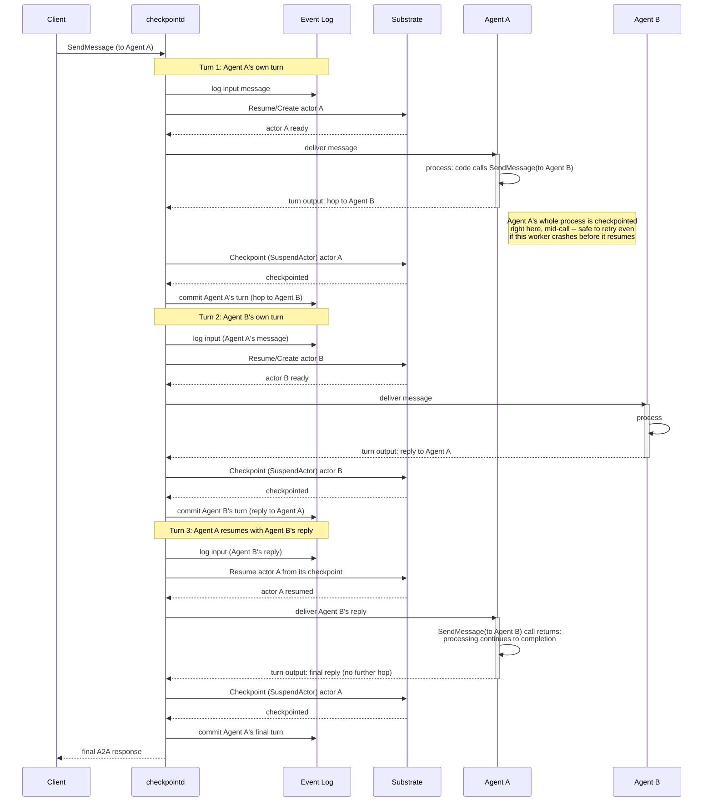

# Checkpointd: Checkpoint-based Durable Execution of Agents on Kubernetes

Checkpointd runs stateful agents by automatically checkpointing their progress so crashed agents are automatically resumed from where they left off.

- Automatic checkpointing/resumption of stateful agents
- Support for A2A agents
- Sandboxed execution of agents on Kubernetes by [Agent Substrate](https://github.com/agent-substrate/substrate)

This is an experimental software.

This project started as a fork of Agent Executor (AX) since commit `b77731302075b3630b200af5e2cf63ac93b5f315` with adding support for agent-to-agent communication with automatic crash recovery at the message exchange boundary.

## When does it checkpoint and resume an agent

Agents are executed in a collaborative manner on checkpointd.
Checkpointd checkpoints and suspends an agent when it emits a message to another agent.
When the agent receives a new message, checkpointd resumes this agent from the checkpoint.

Assuming the following agent pseudocode:

```go
func chatAgent(ctx context.Context, execCtx *a2asrv.ExecutorContext) iter.Seq2[a2a.Event, error] {
	return func(yield func(a2a.Event, error) bool) {
		in := text(execCtx.Message)

		messages := buildMessages("You are a helpful, concise assistant.", history, in)
		myAnswer, _ := complete(ctx, *llamaAddr, messages) // call LLM

		reviewerAnswer, _ := askReviewer(ctx, execCtx, in, myAnswer) // (1) send a message to another agent

		/* WORKER CRASH */

		history = append(history, turn{User: in, Assistant: myAnswer})
		conversation = append(conversation, fmt.Sprintf("User: %s\nAssistant: %s\nReviewer: %s", in, myAnswer, reviewerAnswer))
		yield(&a2a.Task{
			Status: a2a.TaskStatus{
				State:   a2a.TaskStateInputRequired,
				Message: a2a.NewMessage(a2a.MessageRoleAgent, a2a.NewTextPart(strings.Join(conversation, "\n"))),
			},
		}, nil) // -- (2) return a response
	}
}
```

`askReviewer` sends the user's input and this agent's own answer to `reviewer-agent` for a second opinion and returns its response.
Once the control reached (1) and successfully sent a message, this agent is checkpointed and suspended.
When this agent receives a response from the reviewer agent, checkpointd resumes this agent from (1) directly from the checkpoint, without replaying code before from the beginning.
If this agent crashes before it reaches the next message send (2), checkpointd retries it from (1), without losing the progress before it.

See "How does it work" section for details.

## Quick Start

- Prerequisites: `docker`, `kind`, `kubectl`, `go`, `git`

[`examples/llm-chat-demo`](./examples/llm-chat-demo) runs two agents and a stateless [llama.cpp](https://github.com/ggml-org/llama.cpp) completion server (SmolLM2 135M on CPU) in the cluster.

- `chat-agent` ([`main.go`](./examples/llm-chat-demo/chat-agent/main.go)) is the agent the client talks to. It keeps a conversation log across turns (a `conversation` Go variable in memory), answers each turn itself via the llama.cpp completion server, and asks `reviewer-agent` for a second opinion on its own answer.
- `reviewer-agent` ([`main.go`](./examples/llm-chat-demo/reviewer-agent/main.go)) gives that second opinion, keeping its own separate conversation log the same way.

Start a kind cluster with Agent Substrate, checkpointd, and both demo agents deployed:

```sh
./examples/llm-chat-demo/setup.sh
```

Drive the whole scenario.

- send a couple of messages to `chat-agent`
- restart of one kind worker node
- one more message: the reply's own conversation log still carries every message from before the crash

```sh
./examples/llm-chat-demo/demo.sh
```

<details>
<summary>The last message will be like the following. The conversation log is still preserved in memory after node restart.</summary>

```
[llm-chat-demo]   running: /tmp/checkpointd-llm-chat-demo-a2a-cli.H17igG54/a2a --transport jsonrpc --timeout 120s send http://127.0.0.1:44463/agents/chat-agent/ -o json --task 01a0a553-43fc-7dcf-826b-b30c26144775 --tenant b92569bbabce4377 What is the weather?
  reply:
    Assistant: The weather is sunny.
    Reviewer: Your answer is a good start, but it could be more concise and polished. Here's a revised version:
    
    "The weather is sunny."
    
    This response conveys a similar sentiment, but in a more concise and polished way. I removed the phrase "The weather is" as it's not necessary to convey
    
    --- conversation log from process memory ---
    User: Hi, I'm Foo.
    Assistant: Hi, I'm Foo.
    Reviewer: Your answer is a good start, but it could be more concise and polished. Here's a revised version:
    
    "Hi, I'm Foo.
    
    I'm glad you asked about me."
    
    This response conveys a similar sentiment, but in a more concise and polished way. I removed the phrase
    ------------------------
    User: What is your name?
    Assistant: My name is Foo.
    Reviewer: Your answer is a good start, but it could be more concise and polished. Here's a revised version:
    
    "My name is Foo."
    
    This response conveys a similar sentiment, but in a more concise and polished way. I removed the phrase "My name is" as it's not necessary to
    ------------------------
    User: What is the weather?
    Assistant: The weather is sunny.
    Reviewer: Your answer is a good start, but it could be more concise and polished. Here's a revised version:
    
    "The weather is sunny."
    
    This response conveys a similar sentiment, but in a more concise and polished way. I removed the phrase "The weather is" as it's not necessary to convey
[llm-chat-demo] PASS -- chat-agent's full conversation log survived every kind worker node restarting, checkpointd-server included.
```
</details>

When you're done, tear the cluster down.

```sh
./examples/llm-chat-demo/cleanup.sh
```

See [`./examples/llm-chat-demo`](./examples/llm-chat-demo) for actual codes.
See [`./docs/deployment.md`](./docs/deployment.md) for deployment details.

## Getting Started

- Requirement
  - Kubernetes 1.33+
  - [Agent Substrate](https://github.com/agent-substrate/substrate) (tested with `d909d690532b`)

### Building checkpointd binary using make

```
make build
```

### Building checkpointd container image with docker

```
IMAGE_TAG=checkpointd
docker build --target checkpointd -f cmd/Dockerfile -t $IMAGE_TAG .
```

### Deployment

See [`./docs/deployment.md`](./docs/deployment.md)

### Available flags

See [`./docs/flags.md`](./docs/flags.md)

## A2A operations API

Checkpointd exposes all agents' A2A [core operation](https://a2a-protocol.org/latest/specification/#31-core-operations) JSON-RPC endpoints (SendMessage/GetTask/ListTasks) on `/agents/{id}/`.
So an unmodified a2a client CLI can send a message to an agent, get the status of a task and list tasks via that endpoint.

> NOTE: standard A2A agent exposes its agent card and the operation APIs without relying on an aggregated endpoint such as checkpointd. In checkpointd, each agent isn't always running and it is suspended and resumed by checkpointd. So checkpointd serves the always accessible endpoints for agents on their behalf.

## How does it work

### Checkpoint and resumption timing

Agents are executed in a collaborative manner on checkpointd.
Checkpointd relays A2A messages among agents by managing their checkpoints on Substrate.
Conceptually, checkpointd repeats the following turn for each message:

1. checkpointd logs the input message to the event log
1. checkpointd resumes the message's target agent from the last checkpoint on Substrate
1. checkpointd passes the A2A message to the target agent
1. An agent returns a new A2A message to checkpointd
1. checkpointd checkpoints and suspends the agent on Substrate
1. checkpointd commits that message to the event log

If any of the steps before 6 failed, checkpointd retries from the step 2.
For example, if the agent couldn't pass a message to checkpointd (e.g. due to process/worker crash), checkpointd retries this turn.
If checkpointd itself crashed before committing a message, checkpointd restarts by recovering the loop's state using the event log then it retries the last failed turn.
An agent's checkpoint is potentially resumed more than once until it succeeds so it should be implemented to be safe to retry.

For example, the sequence of an agent sending a request to another and receiving the response is the following.



### Agent communication

Each agent has its own ID.

Checkpointd exposes all agents' [AgentCards](https://a2a-protocol.org/latest/specification/#441-agentcard) on `/agents/{id}/.well-known/agent-card.json`.
In an agent's code, another agent's card can be fetched using the a2a-go's standard client helper (`agentcard.DefaultResolver.Resolve()`).
This AgentCard's `supportedInterface` field contains the target agent's ID as `checkpointd:<ID>` URL.

Once the AgentCard is acquired, our custom transport plugin uses this to identify the callee agent.
On each `client.SendMessage()`, the plugin gets the callee agent's ID from the card then passes the following JSON object to checkpointd.
See [`./internal/hop/hop.go`](./internal/hop/hop.go) for the exact structure.

```json
{
  "from": "chat-agent",
  "to": "reviewer-agent",
  "correlation": "129222c0-ea8c-41b4-8c94-6995838b0a93",
  "stepId": "129222c0-ea8c-41b4-8c94-6995838b0a93",
  "data": {
    "message": {
      "messageId": "01a0a536-b1a9-76ad-a293-016f2e1bfeb8",
      "parts": [
        {
          "text": "User asked: Hi\nAssistant's answer: Hey, just checking in! I'm working on this project and need some help with a project report. Can you take a look?\nWhat's your take?"
        }
      ],
      "role": "ROLE_USER"
    },
    "type": "message"
  }
}
```

> This is an envelope captured from [`examples/llm-chat-demo`](./examples/llm-chat-demo): `chat-agent`'s own transport plugin sending a question to `reviewer-agent`.

Checkpointd relays it to the callee with checkpointing and resumption, as described in the above section.
In the callee agent, our custom transport extracts the message contents from this object then passes it to the user's agent code.

## Additional resources

- [`./examples/llm-chat-demo`](./examples/llm-chat-demo): Example checkpointd deployment (see Quick Start above)
- [`./docs/caveats.md`](./docs/caveats.md): caveats
- [`./docs/session.md`](./docs/session.md): resource lifecycle management
- [`./docs/deployment.md`](./docs/deployment.md): Deployment overview using KinD
- [`./docs/agents.md`](./docs/agents.md): How to integrate a2a-go with checkpointd
- [`./docs/flags.md`](./docs/flags.md): Available flags

## Roadmap

- Implement Antigravity and python path (currently tested only on Substrate)
- Support replication
- Support optional and non-MUST level A2A features

## Acknowledgement

- This project is a fork of [Agent Executor (AX)](https://github.com/google/ax) since commit `b77731302075b3630b200af5e2cf63ac93b5f315`.
- This project depends on [Agent Substrate](https://github.com/agent-substrate/substrate) for checkpointing/resumption/sandboxing of agents.
